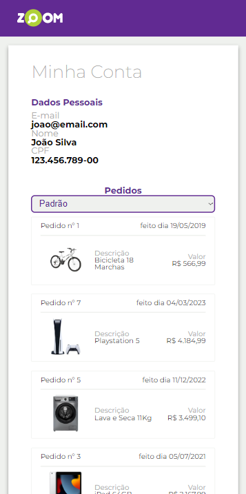
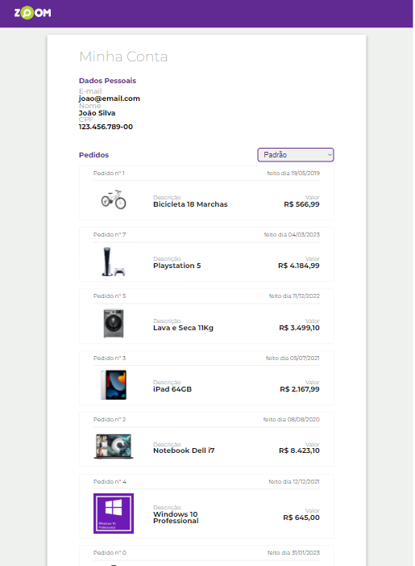
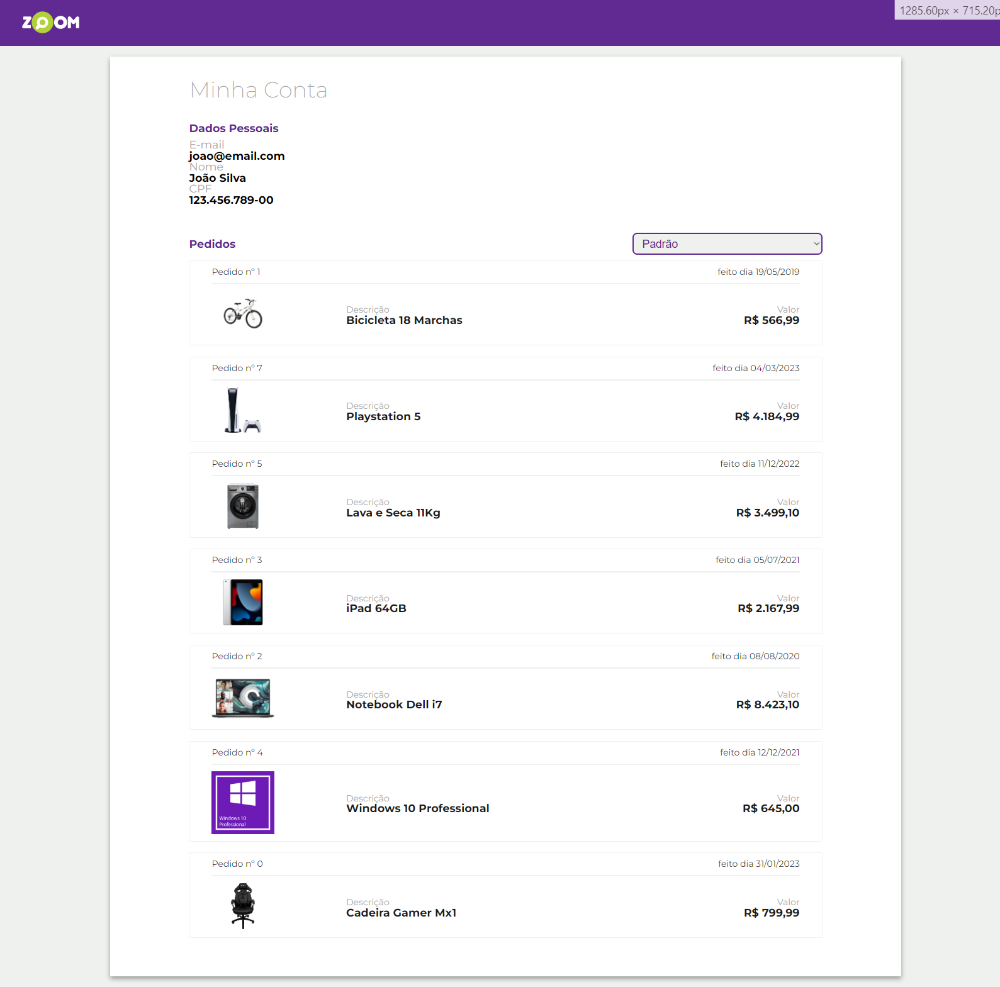

# Zum.

**Uma Single-Page Application inspirada na página de Pedidos do comparador de Preços Zoom. O Zum se propõe a carregar pedidos gravados, devolvendo a pessoa usuária uma lista de seus pedidos, que pode ser classificado de algumas formas diferentes, conforme preferência.**

  
## Linguagens

    
    
    

  
## Tecnologias

    

  
## Habilidades Praticadas

- Modularização de códigos JavaScript
- Gravação, Leitura, Edição e Classificação de Listas de Objetos
- Manipulação de página, sem novo recarregamento 
- Funções Assíncronas
- Orientação a Objetos, com relação de Agregação
- Construção e Consumo de API com Json
- Responsividade com Mobile First
- Conceitos de UI e UX

  
## Screenshot

    
     
    

  
## Disponibilidade

Esta página está disponível no GitHub Pages. 

Para acessar, <a href = "#">clique aqui</a>.

  
## Autoria

Abner Andrade
Graduando em Análise e Desenvolvimento de Sistemas, apaixonado por desenvolvimento e eterno aprendiz.

👋🏽 Curtiu? Entre em contato!

    
    
    

